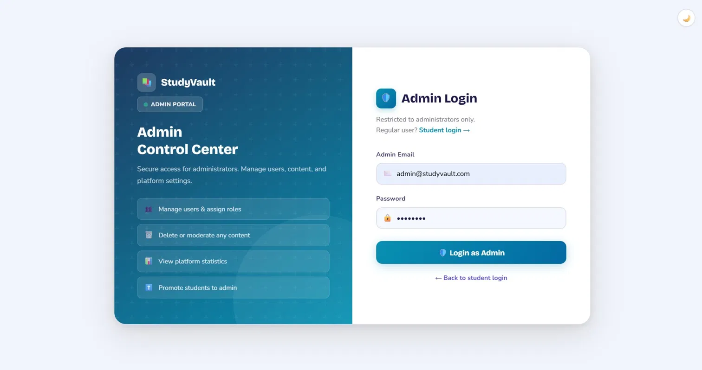
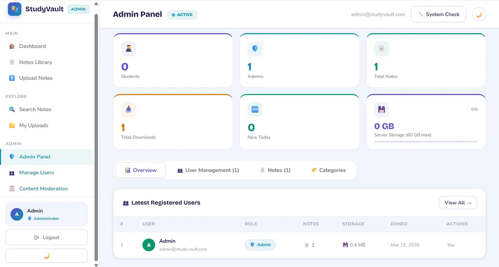
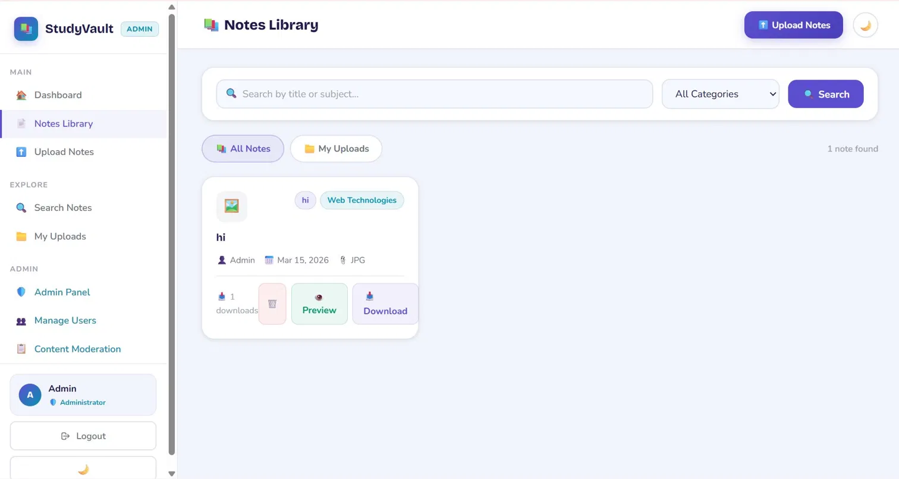
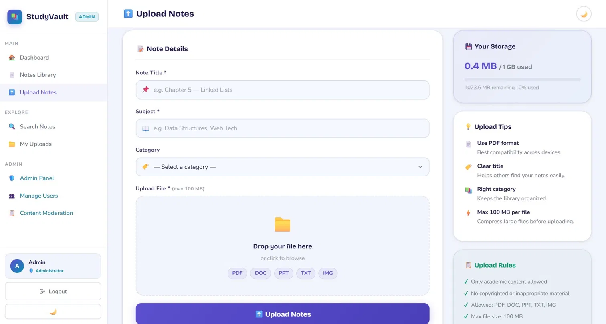

<div align="center">

# 📚 StudyVault

### A Collaborative Academic Notes Sharing Platform


> **BS Information Technology — 6th Semester Final Project**  
> A full-stack web application that enables students to upload, share, preview, and download academic notes with role-based access control and a modern admin panel.

</div>

---

## 📋 Table of Contents

- [Overview](#-overview)
- [Features](#-features)
- [Tech Stack](#-tech-stack)
- [Project Structure](#-project-structure)
- [Database Schema](#-database-schema)
- [API Endpoints](#-api-endpoints)
- [Installation & Setup](#-installation--setup)
- [Usage Guide](#-usage-guide)
- [Security](#-security)
- [Storage Limits](#-storage-limits)
- [Screenshots Preview](#-screenshots-preview)

---

## 🌐 Overview

**StudyVault** is a web-based academic notes management platform designed to help university students collaborate by sharing course materials. Built with pure PHP and MySQL (no external frameworks), it runs entirely on a local XAMPP server — making it lightweight, portable, and easy to deploy in any academic environment.

The platform supports two distinct user roles — **Student** and **Admin** — each with dedicated dashboards, access controls, and management capabilities. Students can upload notes in multiple formats, browse a shared library, preview files before downloading, and track their personal storage usage. Admins have full platform oversight including user management, content moderation, category control, and system-wide analytics.

---

## ✨ Features

### 👨‍🎓 Student Features
| Feature | Description |
|---|---|
| 📤 Upload Notes | Upload PDF, DOC, DOCX, PPT, PPTX, TXT, PNG, JPG files (max 100 MB each) |
| 📂 Notes Library | Browse all shared notes with search and filter by category |
| 🔍 File Preview | Preview notes directly in the browser before downloading |
| ⬇️ Download Notes | Download any note from the shared library |
| 📊 Personal Dashboard | View upload count, download stats, and personal storage usage |
| 🗂️ My Notes | Filter and manage personally uploaded notes |
| 💾 Storage Tracker | Real-time storage usage bar (1 GB limit per user) |

### 🛡️ Admin Features
| Feature | Description |
|---|---|
| 👥 User Management | View all users, create new accounts, assign or update roles |
| 🗑️ Content Moderation | Delete any note from the platform |
| 📁 Category Control | Add and delete note categories |
| 📈 Platform Analytics | Total users, notes, downloads, storage usage in real time |
| 🟢 Online Status | See which users are currently active |
| 🗓️ Activity Tracking | View last login time and registration date per user |
| 📦 Platform Storage | Monitor total platform usage (60 GB limit) |

### 🔧 System Features
- Dark / Light theme toggle with persistent preference
- Responsive layout with collapsible sidebar navigation
- Auto-migration: adds missing database columns on first load
- Drag-and-drop file upload with real-time file info display
- Session-based authentication with `bcrypt` password hashing
- Separate admin login portal (`admin_login.php`)

---

## 🛠️ Tech Stack

| Layer | Technology |
|---|---|
| **Backend** | PHP 8.x (procedural + OOP hybrid) |
| **Database** | MySQL 8.0 via MySQLi (prepared statements) |
| **Frontend** | HTML5, CSS3 (custom properties), Vanilla JavaScript |
| **Typography** | Google Fonts — Bricolage Grotesque, Nunito |
| **Server** | Apache (XAMPP on Windows/macOS/Linux) |
| **Session** | PHP native sessions |
| **Security** | `password_hash()` / `password_verify()` (bcrypt) |
| **Architecture** | MVC-lite with separate API layer (`/api/`) |

---

## 📁 Project Structure

```
study-platform/
│
├── index.php               # Entry point — redirects based on session
├── login.php               # Student login page
├── register.php            # Student registration page
├── admin_login.php         # Separate admin login portal
│
├── dashboard.php           # Main student dashboard with stats
├── notes.php               # Notes library (browse, search, filter)
├── upload.php              # File upload page with drag-and-drop
├── admin.php               # Full admin panel
│
├── autofix.php             # Auto-setup tool (creates admin account)
├── Setup.sql               # Database schema + default seed data
│
├── config/
│   ├── db.php              # Database connection (getDB() function)
│   ├── sidebar.php         # Reusable sidebar navigation component
│   └── theme.php           # Global CSS variables, fonts, and theming
│
├── api/
│   ├── loginAPI.php        # POST — authenticate user, start session
│   ├── registerAPI.php     # POST — create new student account
│   ├── logoutAPI.php       # POST — destroy session, mark offline
│   ├── uploadAPI.php       # POST — handle file upload + DB insert
│   ├── getNotesAPI.php     # GET  — fetch filtered notes list (JSON)
│   ├── downloadAPI.php     # GET  — serve file download + increment counter
│   ├── previewAPI.php      # GET  — serve file for in-browser preview
│   ├── deleteNoteAPI.php   # POST — delete note (admin/owner)
│   ├── createUserAPI.php   # POST — admin creates user
│   ├── deleteUserAPI.php   # POST — admin deletes user
│   └── updateRoleAPI.php   # POST — admin updates user role
│
└── uploads/                # Uploaded notes stored here (auto-created)
```

---

## 🗄️ Database Schema

The database is named `study_platform` and contains **3 core tables**:

### `users`
```sql
id          INT AUTO_INCREMENT PRIMARY KEY
name        VARCHAR(100)
email       VARCHAR(100) UNIQUE
password    VARCHAR(255)          -- bcrypt hashed
role        ENUM('student','admin')
last_login  DATETIME
is_online   TINYINT(1)
created_at  TIMESTAMP
```

### `categories`
```sql
id    INT AUTO_INCREMENT PRIMARY KEY
name  VARCHAR(100) UNIQUE
```
**Default categories:** Programming, Mathematics, Physics, Web Technologies, Database, Other

### `notes`
```sql
id          INT AUTO_INCREMENT PRIMARY KEY
title       VARCHAR(200)
subject     VARCHAR(100)
category_id INT (FK → categories.id)
file_name   VARCHAR(255)
file_path   VARCHAR(255)
file_size   BIGINT                -- in bytes, for quota tracking
uploaded_by INT (FK → users.id)
downloads   INT DEFAULT 0
upload_date TIMESTAMP
```

---

## 🔌 API Endpoints

All API files are located in the `/api/` directory and return `JSON` responses.

| Method | Endpoint | Access | Description |
|---|---|---|---|
| `POST` | `api/loginAPI.php` | 🌐 Public | Login with email & password |
| `POST` | `api/registerAPI.php` | 🌐 Public | Register new student account |
| `POST` | `api/logoutAPI.php` | 🔒 Login Required | Logout and destroy session |
| `POST` | `api/uploadAPI.php` | 🔒 Login Required | Upload a note file |
| `GET` | `api/getNotesAPI.php` | 🔒 Login Required | Get notes (with search/filter) |
| `GET` | `api/downloadAPI.php?id=` | 🔒 Login Required | Download a note by ID |
| `GET` | `api/previewAPI.php?id=` | 🔒 Login Required | Preview a note in browser |
| `POST` | `api/deleteNoteAPI.php` | 🛡️ Admin Only | Delete a note |
| `POST` | `api/createUserAPI.php` | 🛡️ Admin Only | Create a new user |
| `POST` | `api/deleteUserAPI.php` | 🛡️ Admin Only | Delete a user |
| `POST` | `api/updateRoleAPI.php` | 🛡️ Admin Only | Update user role |

---

## ⚙️ Installation & Setup

### Prerequisites
- [XAMPP](https://www.apachefriends.org/) (PHP 8.x + MySQL 8.0 + Apache)
- A modern web browser (Chrome, Firefox, Edge)

### Step 1 — Clone / Place the Project

```bash
# Place the project folder inside XAMPP's htdocs directory
C:\xampp\htdocs\study-platform\
```

### Step 2 — Start XAMPP Services

Open XAMPP Control Panel and start:
- ✅ **Apache**
- ✅ **MySQL**

### Step 3 — Database Setup

**Option A — Automatic (Recommended)**
```
Open browser → http://localhost/study-platform/autofix.php
```
This will create the database, tables, default categories, and the admin account automatically.

**Option B — Manual via phpMyAdmin**
1. Go to `http://localhost/phpmyadmin`
2. Click **New** → Create database named `study_platform`
3. Select the database → click **SQL** tab
4. Paste the contents of `Setup.sql` → click **Go**

### Step 4 — Launch the Application

```
http://localhost/study-platform/
```

### Default Admin Credentials
| Field | Value |
|---|---|
| **URL** | `http://localhost/study-platform/admin_login.php` |
| **Email** | `admin@studyvault.com` |
| **Password** | `admin123` |

> ⚠️ **Change the default admin password immediately after first login.**

---

## 📖 Usage Guide

### For Students
1. Register a new account at `/register.php`
2. Login at `/login.php`
3. Use the **Dashboard** to see your stats and recent activity
4. Go to **Upload Notes** to share study material with the class
5. Browse the **Notes Library** — search by title/subject or filter by category
6. Click **Preview** to view a file in the browser, or **Download** to save it

### For Admins
1. Login at `/admin_login.php` using admin credentials
2. The **Admin Panel** provides tabs for:
   - **Users** — manage all student/admin accounts
   - **Notes** — view and delete any uploaded content
   - **Categories** — add or remove note categories
3. Dashboard shows real-time platform statistics including online users and storage usage

---

## 🔒 Security

| Security Measure | Implementation |
|---|---|
| **Password Hashing** | PHP `password_hash()` with `PASSWORD_BCRYPT` algorithm |
| **SQL Injection Prevention** | All queries use MySQLi **prepared statements** with bound parameters |
| **Session Authentication** | All protected pages check `$_SESSION['user_id']` before rendering |
| **Role-Based Access Control** | Admin routes check `$_SESSION['user_role'] === 'admin'`; unauthorized access redirects to dashboard |
| **File Type Validation** | Server-side whitelist check on file extension before saving |
| **Separate Admin Portal** | Admin login is isolated at `/admin_login.php`, separate from student login |

---

## 💾 Storage Limits

| Limit | Value |
|---|---|
| Max file size per upload | **100 MB** |
| Storage per student account | **1 GB** |
| Total platform storage | **60 GB** |

The upload API enforces all three limits with clear error messages. Storage usage is tracked in real time via the `file_size` column in the `notes` table and displayed as a progress bar on the upload page.

---

## 📸 Screenshots

### 🔐 Admin Login Portal


### 🛡️ Admin Panel — Overview & Stats


### 📚 Notes Library — Browse & Search


### 📤 Upload Notes — Drag & Drop


---

## 🧑‍💻 Author

**Project Type:** BS IT — 6th Semester Final Project  
**Technology:** Full-Stack PHP + MySQL Web Application  
**Environment:** XAMPP (Apache + MySQL) on Localhost  

---

<div align="center">
  <sub>Built with ❤️ team collaboration - StudyVault © 2026</sub>
</div>
